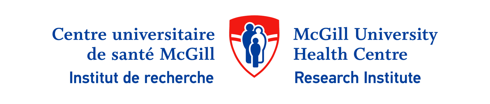
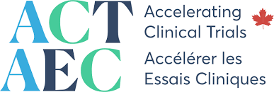

::: {.hero}

# Advancing Clinical Trials at the RI-MUHC

The Accelerating Clinical Trials – Clinical Trials Unit (ACT-CTU) at the Research Institute of the McGill University Health Centre (RI-MUHC) is dedicated to strengthening clinical trial capacity, accelerating study start-up and delivery, and fostering a collaborative and inclusive clinical research ecosystem.

Through strategic initiatives, shared expertise, and national partnerships, the ACT-CTU supports investigators across disciplines in designing and conducting high-quality, impactful clinical trials.

  

:::

---

  
  

---

---

## Our Unit

The ACT-CTU was established to address critical gaps in clinical trial infrastructure and support at the RI-MUHC. By providing centralized expertise, developing shared resources, and connecting researchers with national networks, the unit enables the successful execution of trials across a wide range of therapeutic areas.

Key areas of focus include:

- Supporting trial design, methodology, and regulatory navigation  
- Enhancing patient recruitment and engagement strategies  
- Building institutional infrastructure and shared services  
- Facilitating collaboration across the national ACT network  

---

## The RI-MUHC ACT-CTU in the Spotlight

- **Building an inclusive clinical trial community** — February 28, 2024  
  [Read more](https://rimuhc.ca/-/building-an-inclusive-clinical-trial-community)

- **Increasing clinical trial expertise at the RI-MUHC** — June 28, 2024  
  [Read more](https://muhc.ca/news-and-patient-stories/news/increasing-clinical-trial-expertise-ri-muhc)

- **From Vision to Impact: Transforming clinical trials at the Institute** — March 23, 2026  
  [Read more](https://rimuhc.ca/en/-/from-vision-to-impact-transforming-clinical-trials-at-the-institute)

---

## What We Do

The ACT-CTU leads and supports a diverse portfolio of initiatives designed to strengthen the clinical trials ecosystem at the RI-MUHC.

These include:

- Clinical Trial Rounds and Protocol Review Sessions  
- Deployment of shared regulatory and methodological expertise  
- Development of institutional trial data resources  
- Implementation of clinical trial infrastructure (CTMS, eTMF)  
- Pilot funding programs to seed future trials  
- Patient engagement and inclusive recruitment strategies  

---

## Explore

::: {.grid}

::: {.g-col-4}
### [The Team](team.qmd)

Meet the ACT-CTU team and learn how the unit is structured within the RI-MUHC and the national ACT network.

:::

::: {.g-col-4}
### [Initiatives](initiatives.qmd)

Explore the ACT-CTU’s 11 core initiatives and their impact on clinical trial capacity and performance.

:::

::: {.g-col-4}
### [Other Resources](resources.qmd)

Access ACT tools, knowledge mobilization resources, and communities of practice supporting clinical trials.

:::

:::