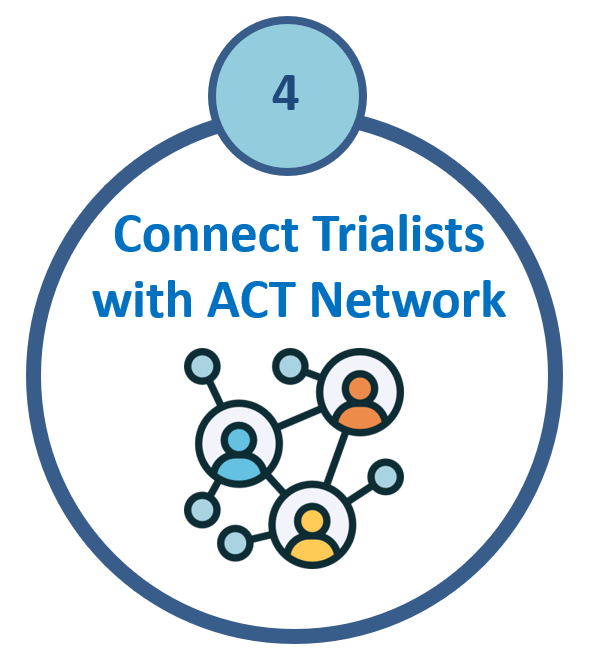

  

  <h1>ACT Network Collaborations</h1>

## Expand Your Trial’s Reach Through the ACT Network

The ACT-CTU supports investigators in expanding the reach of their clinical trials through the national ACT Consortium, enabling recruitment across a network of community (portfolio) hospitals across Canada.

---

## Recruit Patients Through ACT Portfolio Hospitals

If you are seeking to recruit participants for your randomized controlled trial through community hospitals within the ACT Consortium, you can express your interest using the short submission form below.

👉 **[Submit your trial for consideration (5-minute form)](https://redcap.link/ACTTrialsSurvey)**

---

## Explore Ongoing ACT-Affiliated Trials

If you are interested in collaborating on or learning more about existing trials within the ACT network, please consult the current list of active ACT-supported trials:

👉 **[View the current ACT Trials Portfolio](https://redcap.link/ACTTrialsReport)**

---

## About the ACT Portfolio Hospital Program

The **ACT Portfolio Hospital Program** supports the conduct of high-quality randomized controlled trials (RCTs) by providing dedicated research coordination support across a network of community hospitals in Canada.

This program funds Research Coordinators in **20 community hospitals nationwide**, enabling investigators to:
- Expand recruitment beyond academic centres  
- Increase trial feasibility and reach  
- Strengthen equity and diversity in participant enrolment  

👉 **[View participating portfolio hospitals (PDF)](https://act-aec.ca/wp-content/uploads/2025/10/Port-Hosp-Site-Profiles_2025Oct16_no-contact-for-website.pdf)**

---

## Why This Matters

By leveraging the ACT Network, investigators can:
- Accelerate recruitment timelines  
- Improve access to diverse patient populations  
- Enhance trial feasibility and generalizability  
- Strengthen national collaboration and impact  

The ACT-CTU is available to support investigators in connecting with portfolio hospitals and navigating ACT-supported trial pathways.
