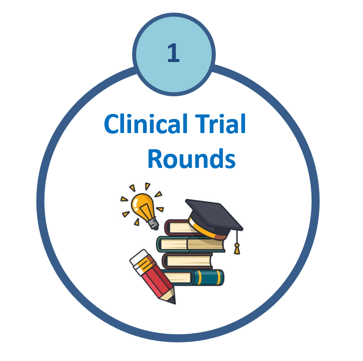

  

  <h1>ACT-CTU Clinical Trial Rounds</h1>

## Past Presentations

| Speaker Photo | Speaker(s) | Date | Topic | Recording |
|---|---|---|---|---|
| {width=90} | Emily McDonald, Sushmita Pamidi, Louise Pilote, Ramy Saleh, Josie Campisi, Amanda Lovato | 2023-12-13 | ACT-CTU Think Tank | [ACT-CTU Seminar - December 13, 2023](https://www.youtube.com/watch?v=wWVm8RATJEI) |
| {width=90} | *Dr. P.J. Devereaux* | 2024-02-06 | Advancing Clinical Trials in Canada and Experience in Perioperative Trials | [Feb. 06, 2024 MUHC Medical Grand Rounds / ACT-CTU Clinical Trial Rounds](https://www.youtube.com/watch?v=uD4etJEeQ2Q) |
| {width=90} | Nancy Mayo | 2024-03-18 | Trials of Complex Interventions: What, Why, Where, and How | [ACT-CTU Clinical Trial Rounds - Dr. Nancy Mayo - March 18, 2024](https://www.youtube.com/watch?v=jER0HCVXH0Q) |
| {width=90} | Patrick Lawler; *Ryan Zarychanski* | 2024-04-24 | Novel Methods in Clinical Trials |   |
| {width=90} | *Lawrence Mbuagbaw, MD, MPH, PhD* | 2024-05-23 | Pilot and Feasibility Trials | [ACT-CTU Clinical Trial Rounds - Dr. Lawrence Mbuagbaw - May 23, 2024](https://www.youtube.com/watch?v=sIv0u6TXQSM) |
| {width=90} | Thao Huynh, MD, PhD | 2024-06-03 | Tips and Pearls to Conduct Successful Clinical Trials | [ACT-CTU Clinical Trial Rounds - Dr. Thao Huynh](https://www.youtube.com/watch?v=V_D8JYhi_y8&t=1158s) |
| {width=90} | Ruth Sapir-Pichhadze, BMedSc, MD, MSc, PhD, FRCPC | 2024-11-06 | Trials & Tribulations: Accelerating Clinical Trials in Immunocompromised Patients |  |
| {width=90} | Simon Bacon, PhD, FTOS, FCCS, FABMR | 2024-12-11 | Behaviour change interventions in clinical trials | [ACT-CTU Seminar - December 11, 2024](https://www.youtube.com/watch?v=h9FEpn_BWkw&t=2s) |
| {width=90} | Cédric Yansouni, MD, FRCPC, DTM&H | 2025-01-15 | Stopping Syphilis Transmission in Arctic communities: The STAR projects |  |
| {width=90} | *Hertzel Gerstein, MD, MSc* + Panel | 2025-03-12 | Industry vs investigator-initiated trials |  | 
| {width=90} | *David Campbell, MD, PhD; Amity Quinn, PhD; Terry Saunders* | 2025-04-10 | Health Policy Trials | [Health Policy Trials Unit](https://www.youtube.com/watch?v=p9Aogp53KkA) |
| {width=90} | Philippe Boileau, PhD | 2025-04-16 | Finding Treatment Effect Modifiers in Clinical Trial Data | [CORE / ACT-CTU Seminar - April 16, 2025](https://www.youtube.com/watch?v=D-xGLVq3CZ8) |
| {width=90} | Diego Herrera; Patricia Li, PhD; *Syamala Buragadda, PhD* | 2025-05-14 | Equity, Diversity, and Inclusion in Trials | [ACT-CTU Clinical Trial Rounds - May 14, 2025](https://www.youtube.com/watch?v=Bnbi3G02d1Y&t=14s) |
| {width=90} | *David E. Leaf, MD, MMSc* | 2025-05-28 | Target Trial Emulation | [ACT-CTU Clinical Trial Rounds - Dr. David E. Leaf - May 28, 2025](https://www.youtube.com/watch?v=zNpbdnq11Tk&t=31s) |
| {width=90} | Isabel Fortier, PhD; Rita Wissa, BSc | 2025-09-29 | Optimizing Data Quality in Clinical Trials | [ACT-CTU Clinical Trial Rounds - Fortier & Wissa](https://www.youtube.com/watch?v=s6GafrAzl7Q) |
| {width=90} | Dmitry Rozenberg, MD, PhD | 2025-11-14 | Inspiratory Muscle Training in Lung Disease |  | 
| {width=90} | Brian Ward, MD | 2025-12-10 | Controlled Human Infection Models | [ACT-CTU Clinical Trial Rounds - December 10, 2025](https://www.youtube.com/watch?v=cwNBwQvcxpI) |
| {width=90} | Gustavo Duque, MD, PhD | 2026-01-19 | Building a Geroscience CTU | [ACT-CTU Clinical Trial Rounds - Dr. Gustavo Duque](https://www.youtube.com/watch?v=g2HCtWYbRW8) |

*Speakers marked with an asterisk were invited to present locally.*