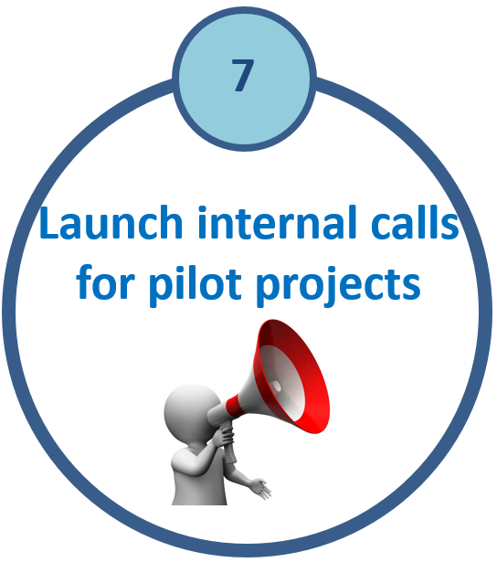

  

  <h1>Internal Calls for Pilot Studies</h1>

## Internal Pilot Trials Program

The ACT-CTU Internal Pilot Trials Program supports the development of high-quality, investigator-initiated clinical trials at the RI-MUHC.

Each selected project receives:

- **$50,000 in funding per trial**
- Methodological and operational support from the ACT-CTU
- Access to institutional and national clinical trial expertise

This initiative is designed to seed innovative studies and position investigators for larger-scale funding opportunities.

---

## 2024 Cohort

- **Number of applicants:** 12  
- **Number of funded trials:** 3  

### Funded Trials

| PI Photo | Principal Investigator | Program | Trial Title |
|---|---|---|---|
| {width=90} | **Yen-I Chen** *(received CIHR funding)* | Cancer Research Program | Prophylactic Endosonography-Guided Gastroenterostomy in Advanced Periampullary Cancers: A Pilot Multicenter Randomized Controlled Trial (INTERCEPT) |
| {width=90} | **Nicole Ezer** | Translational Research in Respiratory Diseases Program | Improving post-operative lung resection outcomes with eosinophil-guided inhaled corticosteroids |
| {width=90} | **Deborah Assayag** | Translational Research in Respiratory Diseases Program | First-line rituximab in patients with systemic autoimmune rheumatic disease-related interstitial lung disease: a pilot study |

---

## 2025 Cohort

- **Number of applicants:** 21  
- **Number of funded trials:** 5  

### Funded Trials

| PI Photo | Principal Investigator(s) | Program | Trial Title |
|---|---|---|---|
| {width=90} | **John Kimoff** | Translational Research in Respiratory Diseases Program | Novel oximetry biomarkers to predict cardiovascular benefit from obstructive sleep apnea treatment: a pilot, feasibility randomized controlled trial |
| {width=90} | **Flavio Fiore** | SIS | Opioid versus opioid-free analgesia after minimally invasive colorectal surgery: a placebo-controlled pilot randomized controlled trial |
| {width=90} | **Suzanne Morin, Nancy Mayo** | MeDiC, BRAiN | People with Osteoporosis Can Walk-BEST to Reduce Fall and Fracture Risk |
| {width=90} | **Tania Janaudis-Ferreira, Bryan Ross** | Translational Research in Respiratory Diseases Program | Web-based Home Exercise and Educational Program for Mild COPD: The HELP-MILD Pilot and Feasibility Randomized Controlled Trial |
| {width=90} | **Emily McDonald** | IDIGH | Secondary Prophylaxis of Recurrent *Clostridioides difficile* Infections During Systemic Antibiotics with Vancomycin (SPORES-V): A Randomized Controlled Trial |

---

## Program Impact

The ACT-CTU Pilot Trials Program has demonstrated strong demand and impact, with increasing application volume and successful progression of funded studies toward larger-scale trials and external funding.

This initiative plays a critical role in strengthening the clinical trials pipeline at the RI-MUHC and fostering innovation across programs.