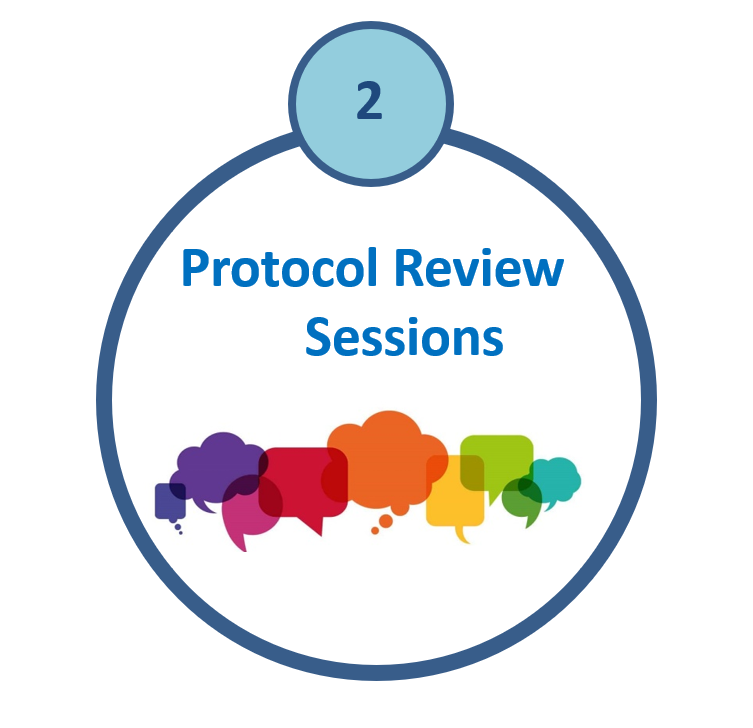

  

  <h1>ACT-CTU Protocol Review Sessions</h1>

## ACT-CTU Protocol Review Sessions

The ACT-CTU Protocol Review Sessions provide investigators with structured, expert feedback on clinical trial design, feasibility, and implementation. Each session brings together multidisciplinary panels to strengthen study rigor and optimize trial success.

## Past Sessions

| Presenter Photo | Speaker(s) | Date | Trial | Panel |
|---|---|---|---|---|
| {width=90} | Sushmita Pamidi | Feb 21, 2024 | RESTful GDM: RESTorative Sleep using a patient-oriented treatment for sleep-disordered breathing in gestational diabetes mellitus (GDM): A randomized controlled trial | Andrea Benedetti; Jonathon Campbell; Simon Bacon; Patricia Li; Julio Flavio Fiore Junior; Marc Beltempo |
| {width=90} | Isabelle Gagnon | Feb 21, 2024 | Direct access physiotherapy in the Pediatric Emergency Department to improve access to and satisfaction with quality care for children and adolescents with musculoskeletal injuries: a randomized control trial | Andrea Benedetti; Jonathon Campbell; Simon Bacon; Patricia Li; Julio Flavio Fiore Junior; Marc Beltempo |
| {width=90} | Tania Janaudis-Ferreira | Feb 21, 2024 | Web-based Home Exercise and Educational Program targeting patients with mild COPD: The HELP-MILD Randomized Controlled Trial | Andrea Benedetti; Jonathon Campbell; Simon Bacon; Patricia Li; Julio Flavio Fiore Junior; Marc Beltempo |
| {width=90} | Nader Sadeghi | Mar 27, 2024 | Neoadjuvant immuno-chemotherapy and de-escalated transoral robotic surgery for HPV-related oropharyngeal cancer | Christina Tsien; Nathaniel Bouganim; Raman Agnihotram; Sameer Parpia |
| {width=90} | Indra Gupta | Aug 15, 2024 | Efficacy of Bryophyllum pinnatum tea for kidney stones | Nandini Dendukuri; Rita Suri; Angela Genge |
| {width=90} | Caroline Paquette | Aug 15, 2024 | Rewiring the brain to reduce freezing of gait in Parkinson’s disease | Nandini Dendukuri; Rita Suri; Angela Genge |
| {width=90} | Dan Poenaru | Aug 21, 2024 | Virtual reality-based pediatric trauma training feasibility trial | Isabelle Gagnon; Steven Grover; Matthias Friedrich; Dick Menzies |
| {width=90} | Reza Farivar | Sep 12, 2024 | Ketogenic enteral feed in severe traumatic brain injury | Deborah Assayag; Simon Ducharme |
| {width=90} | Mona Ben M'Rad; Soham Rej; Rita Suri | Dec 5, 2024 | Virtual reality use for exercise in hemodialysis (VIRTUE-HD) | Nancy Mayo; Tina Athanasoulias |
| {width=90} | Sheldon Magder | Feb 13, 2025 | IV acetaminophen and post-operative delirium following cardiac surgery | Jose Morais; Elham Rahme |
| {width=90} | John Kimoff | Feb 13, 2025 | Positive airway pressure and cardiovascular risk in obstructive sleep apnea | Jose Morais; Elham Rahme |
| {width=90} | Dr. Reza Farivar | Feb 18, 2025 | Reversing amblyopia in children through a participatory framework | Marc Beltempo; Tania Janaudis-Ferreira; Isabelle Gagnon; Isabelle Morin |
| {width=90} | Dr. Gustavo Duque | Feb 18, 2025 | Effects of HMB and HOBA on aging and intrinsic capacity | Marc Beltempo; Tania Janaudis-Ferreira; Isabelle Gagnon; Isabelle Morin |
| {width=90} | Rita Suri; Mohamed Elahmedi | Mar 18, 2025 | AI-driven prediction of dialysis blood pressure fluctuations | Remi Goupil; Elaine Kaptein; Emily McDonald; Dan Poenaru |
| {width=90} | James Tsui | Apr 24, 2025 | Low-dose radiation for osteoarthritic lumbar inflammation (RELIEF) | Philippe Boileau; Sasha Bernatsky |
| {width=90} | Abhinav Sharma | Aug 21, 2025 | Semaglutide in heart failure (Sema-HFrEF feasibility pilot trial) | John Kimoff; Kaberi Dasgupta |
| {width=90} | Louise Pilote | March 2026 | Social Prescribing Trial | TBD |